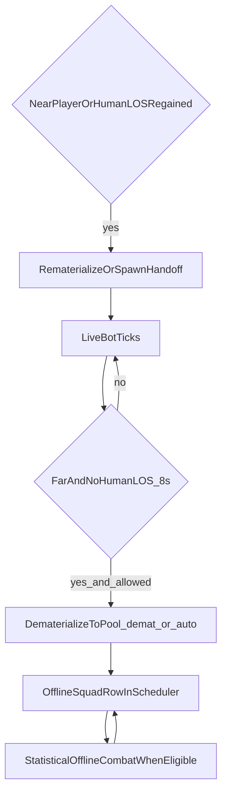

# SMART dematerialize + offline + materialize (Phase 1+2, balanced)

## Locked decisions (from you)

- **Scope:** Phase **1 + 2** in one delivery track (not “demat-only first”).
- **Trigger profile (balanced):** start from **~180 m** min distance to nearest human and **~8 s** sustained “no human LOS” before dematerialize, with **standard gameplay guards** (see below). Treat numbers as **tunable constants** in one place (preset or `General` settings) so playtests can move them without refactors.

## What already exists (do not reinvent)

- **Pool + intercept destroy:** [`OptimizedMod/SAIN/SAIN/Components/BotGameObjectPool.cs`](E:/spt-tarkov-ai/OptimizedMod/SAIN/SAIN/Components/BotGameObjectPool.cs) + [`OptimizedMod/SAIN/SAIN/Patches/BotPoolPatches.cs`](E:/spt-tarkov-ai/OptimizedMod/SAIN/SAIN/Patches/BotPoolPatches.cs) (global `Destroy` prefix; already documented as high-risk/high-value).
- **Dematerialize/rematerialize API:** [`OptimizedMod/SAIN/SAIN/Components/BotDematerializationController.cs`](E:/spt-tarkov-ai/OptimizedMod/SAIN/SAIN/Components/BotDematerializationController.cs) registers `demat_*` squads and pools the `GameObject`.
- **AILimit integration:** [`OptimizedMod/AILimit/Component.cs`](E:/spt-tarkov-ai/OptimizedMod/AILimit/Component.cs) calls `TrySainDematerialize` / `TrySainRematerialize`.
- **Proximity remat for parked bots:** [`OptimizedMod/SAIN/SAIN/Components/OfflineSquadMaterialization.cs`](E:/spt-tarkov-ai/OptimizedMod/SAIN/SAIN/Components/OfflineSquadMaterialization.cs) (`demat_*` only; throttled pass).
- **Offline combat + `auto_*` squads:** [`OptimizedMod/SAIN/SAIN/Components/OfflineSquadWorldSync.cs`](E:/spt-tarkov-ai/OptimizedMod/SAIN/SAIN/Components/OfflineSquadWorldSync.cs) + [`OptimizedMod/SAIN/SAIN/Components/AIFrameBudgetScheduler.cs`](E:/spt-tarkov-ai/OptimizedMod/SAIN/SAIN/Components/AIFrameBudgetScheduler.cs) (`IsAutoManagedSquad` excludes `auto_*`/`demat_*` from casualty trimming; `OfflineCombatResult` in [`OfflineCombatResolver.cs`](E:/spt-tarkov-ai/OptimizedMod/SAIN/SAIN/Components/OfflineCombatResolver.cs)).
- **Raid tick ordering (important):** documented in [`docs/SAIN_AILIMIT_DEMATERIALIZATION.md`](E:/spt-tarkov-ai/docs/SAIN_AILIMIT_DEMATERIALIZATION.md): `BotManagerComponent.ManualUpdate` runs offline sync, proximity remat pass, then `BudgetScheduler.ProcessFrame`.
- **Pool pull gap (repo fact):** `BotGameObjectPool.TryGetFromPool` exists but has **no shipping C# callers** in `OptimizedMod` yet; [`docs/SAIN_PERFLOG.md`](E:/spt-tarkov-ai/docs/SAIN_PERFLOG.md) notes pool hit/miss counters stay 0 until something calls it. Phase 2 spawn must **wire** spawn-to-pool or document **Instantiate-only** for the first ship.

## Conflict matrix and integration risks (final check)

Conclusion: **no hard incompatibility** with the current modular stack (SAIN demat/pool/offline + AILimit hooks). Risks are **coordination, ordering, and edge cases** — address explicitly in implementation.

| Area | Risk | Mitigation (plan-owned) |
|------|------|-------------------------|
| AILimit vs SMART demat gate | Two policies demat/remat the same bot in conflicting frames → **oscillation** | Single coordinator or strict rules: skip SMART if AILimit owns state; use `IsDematerialized`; **per-profile cooldown** after remat; telemetry `SmartDemat*` vs AILimit reason |
| Proximity/LOS remat vs AILimit “stay parked” | Remat near hearing/LOS then immediate AILimit demat → **thrash** | Align remat eligibility with AILimit **active** window when AILimit loaded; **hysteresis** (distance + time); optional remat suppress window |
| `BotPoolPatches` + `ReturnToPool` | **Destroy** on a GO already **pooled** by demat could double-enqueue or confuse `IsActiveBot` | Idempotent `ReturnToPool` / patch early-out if instance already queued or tracked dematerialized; add tests around death-after-demat |
| ABPS / spawn caps | ABPS has **no** SAIN pool references; **runtime** cap vs demat/pooled counts can disagree | Before `auto_*` spawn: query cap / degrade (delay, audio-only); document in `SAIN_AILIMIT_DEMATERIALIZATION` follow-ups |
| Offline squad IDs | `IsAutoManagedSquad` keys off `auto_` / `demat_` prefixes | **No new parallel prefixes**; extend `OfflineSquadWorldSync` constants only |
| `ManualUpdate` order | Same-frame remat then demat if order wrong | Fix one documented sequence: e.g. `TrySync` → remat passes → **SMART gate eval** → `ProcessFrame`; avoid remat/demat same bot same frame without cooldown |
| Boss / strict types | Wrong bots dematerialized | Reuse [`BotSpawnController.StrictExclusionList`](E:/spt-tarkov-ai/OptimizedMod/SAIN/SAIN/Classes/BotManager/BotSpawnController.cs) (or shared helper) in SMART gate |

## Conflict resolutions (concrete design)

These are the **default resolutions** to implement so the matrix rows close with minimal ambiguity.

### R1 — AILimit vs SMART demat (single writer, layered release)

- **Single demat API:** Both AILimit and `SmartDematerializeGate` call only `BotDematerializationController.RequestDematerialize(bot, reason)`. Extend `DematerializedEntry` (or parallel map) to store **`ParkReason` bitflags** (`AILimit`, `SmartLos`) set on first successful park; add `AddParkReason` / `HasParkReason` so a bot can be held by **both** without double `ReturnToPool` (second call no-ops if already dematerialized).
- **Release rule:** `RequestRematerialize` succeeds only when **all** holders agree **or** define priority: e.g. **AILimit is mandatory for “active GameObject”** when AILimit plugin is on — SMART can add `SmartLos` flag but remat still requires AILimit’s “would be active” check (see R2). When AILimit is **off**, SMART alone owns release.
- **SMART demat precondition:** Do not call SMART demat if `RequestDematerialize` would duplicate an already-pooled same frame; always `IsDematerialized(profileId)` first.

### R2 — Proximity/LOS remat vs AILimit thrash (remat suppress + aligned eligibility)

- **Remat suppress window:** After any successful `RequestRematerialize`, set `NextDematEligibleTime[profileId] = Time.time + 2.5f` (tunable). AILimit’s deactivate branch skips demat for that profile until elapsed (unless bot is dead).
- **Proximity remat guard:** In `OfflineSquadMaterialization`, before `RequestRematerialize`, if AILimit is loaded, require **the same distance/top-N predicate AILimit uses** for “would activate” **or** require human inside `botDistance` (expose a tiny static helper on AILimit or duplicate constants from config with a comment). That stops “hearing remat” from waking bots AILimit will kill next frame.

### R3 — `BotPoolPatches` + `ReturnToPool` idempotency

- **Track pooled instance IDs:** Maintain `HashSet<int>` of instance IDs currently **in any queue** (updated on enqueue/dequeue/`TryRemoveFromPool`).
- **`ReturnToPool`:** If `instanceId` already in pooled set, return **true** (no-op) without double-enqueue. If object `activeSelf` and already in `_activeBotInstanceIds` as active, follow existing path.
- **`InterceptDestroy`:** If instance is **in pooled set** or `Dematerialization.IsDematerialized(profileId)` for that GO’s bot, **return false** (skip Destroy) so pooled shells are not destroyed by stray vanilla teardown; log once per raid under diagnostic toggle if needed.
- **Death path:** If design requires true removal from world, **explicitly** `TryRemoveFromPool` + allow Destroy only from a **SAIN-owned** death handler — document; otherwise pooled death stays pooled.

### R4 — ABPS / spawn caps

- **Pre-spawn check:** Before `auto_*` materialize, read live bot count from `GameWorld` / `BotsController` / `BotSpawner` (whichever the spawn path uses) and compare to **effective cap** (vanilla `MaxBots` and, if present, ABPS-adjusted limits via reflection or a small interop interface). If at cap: **defer** (`PendingAutoSpawn` queue, retry next throttle tick) or **audio-only** outcome per config.
- **Document** cap behavior in [`docs/SAIN_AILIMIT_DEMATERIALIZATION.md`](E:/spt-tarkov-ai/docs/SAIN_AILIMIT_DEMATERIALIZATION.md) open follow-ups table.

### R5 — Offline squad IDs

- Centralize prefixes in `OfflineSquadWorldSync` only; any new squad type extends `IsAutoManagedSquad` in **one** PR with tests grep for `StartsWith`.

### R6 — `ManualUpdate` order (canonical)

1. `OfflineSquadWorldSync.TrySync`
2. `OfflineSquadMaterialization` (proximity + future LOS remat)
3. **`SmartDematerializeGate.TryApply`** (new; demat only)
4. `BudgetScheduler.ProcessFrame`

Inside gate and remat: respect `NextDematEligibleTime` / same-frame guard (`_lastTransitionFrame` per profile).

### R7 — Boss / strict types

- Extract `BotSpawnController.IsBotTypeStrictlyExcluded(WildSpawnType)` (static) used by **both** `AddBot` and `SmartDematerializeGate`.

## Target behavior (end state)

- **Phase 1 contribution:** dematerialize bots that are **wasting CPU** because they are far and not human-visible, even if AILimit would not park them.
- **Phase 2 contribution:** for squads/rows that are **purely offline** (`auto_*`) or dematerialized long enough, apply **`OfflineCombatResult` → world reconciliation** on rematerialize (minimal viable first: HP/death + spawn if alive; defer full loot/corpse fidelity to a follow-up if needed).

## Phase 1 implementation plan (balanced)

### 1) Add a SAIN-side “SMART dematerialize eligibility” evaluator

- **New component/service** (preferred) under [`OptimizedMod/SAIN/SAIN/Components/`](E:/spt-tarkov-ai/OptimizedMod/SAIN/SAIN/Components/) (e.g. `SmartDematerializeGate`) called from [`BotManagerComponent.ManualUpdate`](E:/spt-tarkov-ai/OptimizedMod/SAIN/SAIN/Components/BotManagerComponent.cs) at the **canonical order** (section R6).
- **Inputs per bot:** distance to nearest human; **human LOS** via existing tiering / `SAINAILimit` visibility helpers (no second full ray budget).
- **State machine:** accumulate `noHumanLosSeconds` with hysteresis; reset on LOS or distance inside band.
- **Guards:** goal enemy / combat pressure; `IsBotTypeStrictlyExcluded`; optional extract/script exclusions.

### 2) Route eligible bots through existing dematerialize API

- Call `RequestDematerialize(bot, "smart-los-distance")` with R1 idempotency.

### 3) Extend rematerialize triggers beyond proximity/hearing

- Extend [`OfflineSquadMaterialization`](E:/spt-tarkov-ai/OptimizedMod/SAIN/SAIN/Components/OfflineSquadMaterialization.cs) with LOS remat + R2 AILimit alignment + remat reason for telemetry.

## Phase 2 implementation plan (balanced, minimal viable handoff)

### 4) `auto_*` materialization contract (minimal viable)

- Default **A:** alive members + approximate HP at remat; **B:** eliminated → no spawn + optional [`CombatAudioSpoofer`](E:/spt-tarkov-ai/OptimizedMod/SAIN/SAIN/Components/CombatAudioSpoofer.cs).

### 5) Spawn/state handoff

- MoreBotsAPI and/or ABPS client; orchestrator consumes `OfflineCombatResult`; `BotSpawnController.AddBot` for lifecycle.

### 6) Caps and pool

- R4 + `RegisterActiveBot` / `TryGetFromPool` wiring per R3/`trygetfrompool-wire` todo.

## Telemetry + verification

- `SmartDematCandidates`, `SmartDematApplied`, `SmartRematLos`, `SmartRematNear`, `AutoSpawnAttempts`, `AutoSpawnFailures`; `SpawnEventCsvLogger` events `SmartDemat`, `SmartRemat`, `AutoMat`.

## Documentation updates

- [`INDEX.md`](E:/spt-tarkov-ai/INDEX.md), [`docs/SMART_OFFLINE_COMBAT.md`](E:/spt-tarkov-ai/docs/SMART_OFFLINE_COMBAT.md), [`docs/SAIN_AILIMIT_DEMATERIALIZATION.md`](E:/spt-tarkov-ai/docs/SAIN_AILIMIT_DEMATERIALIZATION.md).

## Exit criteria

- Material FPS improvement on high-bot maps; no demat/remat oscillation in telemetry; no silent `auto_*` spawn failures.

## Explicit follow-ups

- Corpse/loot from offline rolls; boss/scripted map policies.
