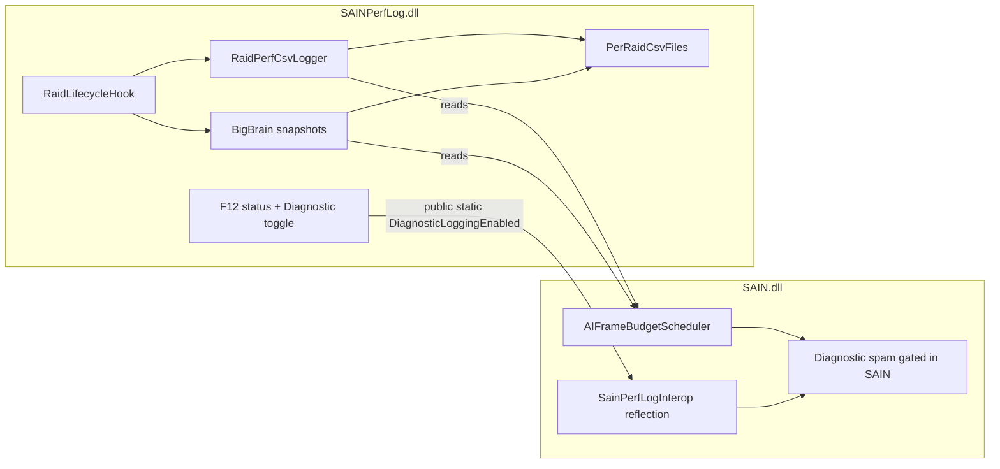

# SAIN Perf Logging Standalone Mod Plan

> Last updated: 2026-05-03  
> Status: **Implemented** in `OptimizedMod/SAINPerfLog/` (raid CSV + optional BigBrain snapshots + **F12** status/diagnostic toggles). SAIN no longer ships a **SAIN Performance** config section.

**Canonical “what shipped + how to use” doc:** [SAIN_PERFLOG.md](SAIN_PERFLOG.md) (this file remains design history, mermaid, and checklists).

---

## Goal

Split SAIN performance logging into a standalone BepInEx mod so logging:

- starts automatically at raid start,
- stops and closes files on raid end,
- creates one file per raid (no overwrite),
- keeps lightweight but high-signal BigBrain behavior diagnostics.

---

## Why change is needed

**Historical context:** older in-SAIN logging wrote a fixed path (`BepInEx/LogOutput/sain_perf.csv`, non-append / re-init truncation). The standalone plugin replaces that with **per-raid files** under `BepInEx/LogOutput/sain_perf/` and deterministic close on raid teardown.

---

## Target architecture

---

## Standalone plugin behavior

### Raid lifecycle

- Hook raid start using the same game lifecycle SAIN already relies on.
- Attach logger component once per active raid world.
- On `GameWorld.OnDispose`, flush + close writer deterministically.
- Skip hideout.

### Per-raid file naming

- Directory: `BepInEx/LogOutput/sain_perf/`
- Main perf file:
  - `sain_perf_{UtcTimestamp}_{LocationId}_{SessionToken}.csv`
- Optional sparse BigBrain file:
  - `sain_bigbrain_{UtcTimestamp}_{LocationId}_{SessionToken}.csv`

---

## Data quality requirements

- Keep existing core perf schema semantics (`FPS`, `FrameTimeMs`, `BudgetMs`, `BudgetUtil%`, tiers, processed/skipped) so historical comparisons remain valid.
- Use UTC timestamps.
- Flush row writes and close on raid end.
- Add `SchemaVersion` for evolvable parsing.
- Preserve continuity fields for sparse diagnostics:
  - `RaidElapsedSec`
  - `SainBotsTotal`
  - `SainBotsSampled`

---

## Sparse BigBrain diagnostics (lightweight + useful)

### Purpose

Diagnose layer arbitration/fallback problems (e.g., `GClass###`) without heavy per-second or per-bot logging.

### Sampling

- Default interval: 30-60s (independent from perf CSV interval).
- One O(n) bot scan per sample over SAIN bots.
- Aggregate output only (no per-bot rows by default).

### Snapshot fields

- `SchemaVersion`
- `TimestampUtc`
- `RaidElapsedSec`
- `SainBotsTotal`
- `SainBotsSampled`
- `LayerHistogram` (compact count string)
- `MismatchCombatSignals` (count only)

### Coalescing (quality-safe)

- May skip writing when:
  - histogram unchanged,
  - mismatch unchanged,
  - mismatch is `0`.
- Must not coalesce rows with `MismatchCombatSignals > 0`.
- Optional heartbeat row for liveness evidence.

---

## BotDebug inspiration used

Reference repo: [DrakiaXYZ/SPT-BotDebug](https://github.com/DrakiaXYZ/SPT-BotDebug)

Borrowed patterns:

- Lightweight lifecycle hook + component attachment per raid.
- Throttled updates (timer-based, not every frame).
- Keep expensive introspection off per-frame path.
- BigBrain introspection through `BrainManager.GetActiveLayer*` style APIs.

Deliberately not copied:

- Per-bot rich overlay/GUI pipelines (too expensive for always-on telemetry).
- Per-second full-detail bot streams.

---

## Code touchpoints (implemented)

- `OptimizedMod/SAIN/SAIN/Components/BotManagerComponent.cs`
- `OptimizedMod/SAIN/SAIN/SAINPlugin.cs` (no perf/F12 section)
- `OptimizedMod/SAIN/SAIN/Components/AIFrameBudgetScheduler.cs`
- `OptimizedMod/SAIN/SAIN/Classes/Bot/SAINAILimit.cs`
- `OptimizedMod/SAIN/SAIN/Layers/Combat/Squad/SquadCombatCoordinator.cs`
- `OptimizedMod/SAIN/SAIN/Interop/SainPerfLogInterop.cs` (reads `DiagnosticLoggingEnabled` and **`BigBrainDiagVerboseSampling`** from `PerfLogPlugin` via reflection)
- `OptimizedMod/SAINPerfLog/` project (`PerfLogPlugin.cs`, `Components/RaidPerfCsvLogger.cs`, Harmony raid hook). **F12 → `3. BigBrain verbose sample`:** when Diagnostic Logging is on, SAIN logs periodic **Info** lines for every human-proximate bot’s active BigBrain layer.

---

## Validation checklist

- Raid start creates new per-raid CSV file(s).
- Raid end closes writer (no file lock, no overwrite of prior raids).
- Second raid produces new file; previous remains intact.
- Sparse BigBrain file remains small while still exposing arbitration anomalies.
- No noticeable FPS regression from logging at default intervals.

